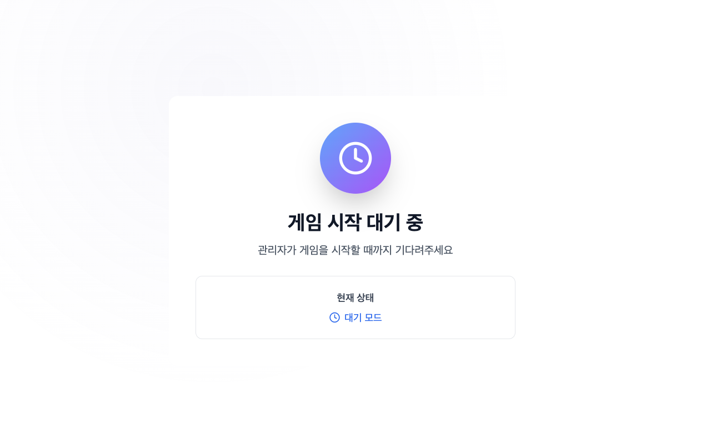
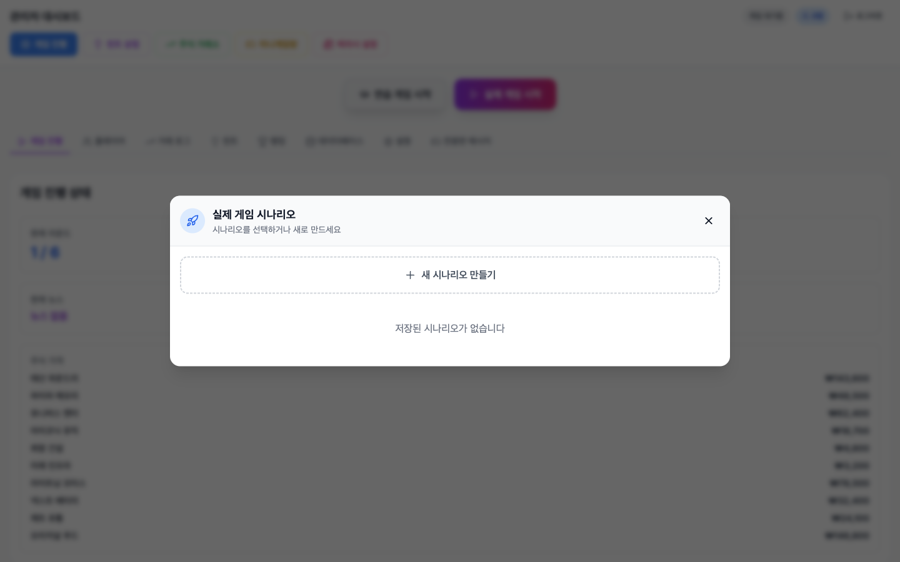
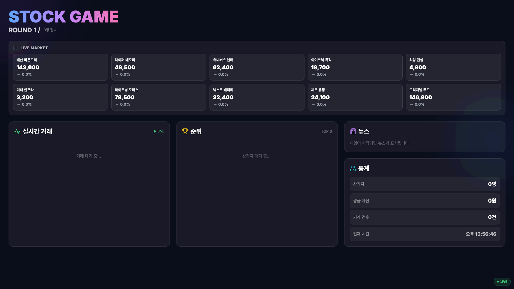

# Investment Game

실시간 멀티플레이어 주식 투자 시뮬레이션 게임. 관리자가 시나리오와 라운드를 제어하고, 참가자들이 뉴스를 분석해 주식을 매매하며 최종 자산을 경쟁합니다. 60명 이상 동시 접속을 지원합니다.

## 스크린샷

### 플레이어 화면 — 닉네임으로 입장



### 관리자 대시보드 — 게임 제어 및 종목 현황


### 시나리오 선택 — 커스텀 시나리오 또는 기본 시나리오



### 4K 전광판 — 실시간 시세, 거래 현황, 순위



---

## 게임 진행 방식

1. 관리자가 `/admin`에서 시나리오를 선택(또는 직접 제작)하고 게임을 시작합니다.
2. 참가자들은 `/player`에서 닉네임으로 입장 후 주식을 매수/매도합니다.
3. 관리자가 라운드를 진행할 때마다 뉴스가 공개되고 주가가 변동됩니다.
4. 모든 라운드가 끝나면 최종 자산 기준으로 순위가 결정됩니다.
5. `/display`에서 실시간 시세, 거래 로그, 순위를 4K 화면에 표출합니다.

---

## 기본 시나리오 — 2025 대한민국 격동의 주식 시장

**6라운드** · 10개 종목 · 2025년 실제 이슈 기반

| 라운드 | 기간 | 헤드라인 |
|--------|------|----------|
| 1 | 1~2월 | 격변의 시작, 1만 원 시대와 AI 열풍 |
| 2 | 3~4월 | 심판의 날과 K-컬처의 독주 |
| 3 | 5~6월 | 보랏빛 물결과 새로운 권력의 탄생 |
| 4 | 7~8월 | 빅딜의 시대, 사법의 칼날 |
| 5 | 9~10월 | 경주 APEC과 대한민국 경제 신기원 |
| 6 | 11~12월 | 미디어 빅딜과 두쫀쿠 신드롬 |

### 라운드별 주요 뉴스

**R1 · 1~2월 — 격변의 시작**
- 최저임금 10,030원 시대 개막 — 자영업계 '밀크플레이션' 비상
- AI 생성형 이미지 대유행 — MZ세대 SNS 점령

**R2 · 3~4월 — 심판의 날**
- 헌재, 대통령 탄핵 만장일치 인용 — 파면 선고
- 드라마 '폭삭 속았수다' 글로벌 흥행 — 제주도 관광 급증

**R3 · 5~6월 — 새로운 권력의 탄생**
- 제21대 대통령 이재명 당선 확정
- BTS 완전체 복귀 + 정부 'AI 100조 투자' 계획 발표

**R4 · 7~8월 — 빅딜의 시대**
- 삼성전자-테슬라 22조 AI 칩 계약 체결
- 한미 관세 협상 '15% 하향' 극적 타결

**R5 · 9~10월 — 경주 APEC**
- 코스피 사상 첫 4,000포인트 돌파
- 경주 APEC 2025 개최 — 핵잠수함 건조 승인

**R6 · 11~12월 — 미디어 빅딜**
- 넷플릭스, 워너브라더스 인수 전격 발표
- 두쫀쿠(두바이 쫀덕 쿠키) 열풍 — 전국 오픈런 대란

---

## 종목 구성

### 실제 게임 (10종목)

| 종목명 | 기준가 | 섹터 |
|--------|--------|------|
| 태산 파운드리 | ₩143,600 | 우량주 |
| 오리지널 푸드 | ₩146,800 | 필수소비재 |
| 라이트닝 모터스 | ₩78,500 | 수출주 |
| 유니버스 엔터 | ₩62,400 | 이슈주 |
| 하이퍼 메모리 | ₩48,500 | 기술주 |
| 넥스트 배터리 | ₩32,400 | 에너지주 |
| 제트 유통 | ₩24,100 | 물류주 |
| 아이코닉 뮤직 | ₩18,700 | 트렌드주 |
| 희망 건설 | ₩4,800 | 정치 테마A |
| 미래 인프라 | ₩3,200 | 정치 테마B |

### 연습 게임 (3종목)

| 종목명 | 기준가 | 설명 |
|--------|--------|------|
| 십자가메고활강1 | ₩100,000 | 연습 전용 |
| 십자가메고활강2 | ₩100,000 | 연습 전용 |
| 십자가메고활강3 | ₩100,000 | 연습 전용 |

> 커스텀 시나리오를 만들면 원하는 종목명과 기준가로 게임을 진행할 수 있습니다.

---

## 화면 구성

| 경로 | 설명 |
|------|------|
| `/` 또는 `/player` | 플레이어 화면 — 주식 매매, 포트폴리오, 랭킹 |
| `/admin` | 관리자 대시보드 — 게임 제어, 시나리오 편집, 플레이어 관리 |
| `/display` | 4K 전광판 — 실시간 차트, 시세 티커, 순위 |

---

## 기술 스택

- **Frontend**: React 18, Vite, Tailwind CSS, Recharts, Framer Motion
- **Backend**: Express, Socket.io
- **DB**: SQLite (better-sqlite3, WAL 모드)
- **통신**: Socket.io 실시간 이벤트 (REST 없음)

---

## 시작하기

### 설치

```bash
npm install
```

### 환경 변수 설정

```bash
cp .env.example .env
```

| 변수 | 설명 |
|------|------|
| `PORT` | 서버 포트 (기본값: 3001) |
| `ADMIN_ID` | 관리자 아이디 |
| `ADMIN_PASSWORD` | 관리자 비밀번호 |
| `CORS_ORIGINS` | 허용 CORS 출처 |
| `NODE_ENV` | `development` / `production` |

### 실행

```bash
# 프론트엔드 + 백엔드 동시 실행
npm run dev:all

# 개별 실행
npm run server   # 백엔드 (Express + Socket.io, :3001)
npm run dev      # 프론트엔드 (Vite, :5173)
```

### 빌드

```bash
npm run build
```

---

## 프로젝트 구조

```
├── server.js                  # Express 서버 진입점
├── services/                  # 비즈니스 로직 서비스 레이어
│   ├── index.js               # createServices(io) — DI 진입점
│   ├── GameStateService.js    # 게임 흐름, 라운드 진행, 가격 계산
│   ├── BroadcastService.js    # Socket.io 브로드캐스트 (스로틀링)
│   ├── PlayerService.js       # 플레이어 등록, 포트폴리오
│   ├── TradingService.js      # 매매 검증 및 실행
│   └── ...
├── socket/handlers/           # Socket.io 이벤트 핸들러 (도메인별)
├── state/StateManager.js      # 인메모리 상태 + DB 영속성
├── shared/
│   ├── socketProtocol.js      # 이벤트 상수 및 상태 헬퍼 (공유)
│   └── getActiveStocks.js     # 커스텀/연습/실제 종목 해석 (공유)
├── src/
│   ├── pages/
│   │   ├── PlayerPage.jsx
│   │   ├── DisplayBoardPage.jsx
│   │   └── admin/
│   ├── hooks/useSocketSync.js # 모든 Socket.io 상태·액션 중앙 훅
│   └── data/initialScenarios.js
├── db.js                      # SQLite 초기화 및 헬퍼
└── tests/                     # Node.js 내장 assert 기반 테스트
```

## 테스트

```bash
node tests/services.test.js
node tests/stateManager.test.js
node tests/handlers.test.js
node tests/socketProtocol.test.js
node tests/idempotency.test.js
node tests/dbScenarios.test.js
node tests/providerHintPools.test.js
```

## DB 점검

```bash
npm run check-db
```

## 라이선스

MIT
